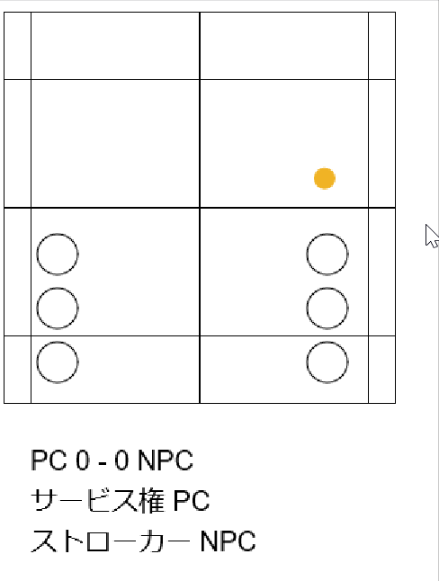

readnext
===============

バドミントンの配球を読んで遊ぶゲームです。

## 完成イメージ

完成イメージは以下のようになっています。  

## 遊び方

自分のコートにシャトルがある場合は打ちたいコースを選択してください。
相手のコートにシャトルがある場合は、来そうなコースを選択してください。
予測があっていた場合、ミスをしやすいようになっています。

## 実行方法
JavaとLeiningenを入れた状態で./scripts/buildを叩きます。
そのうえで、index.htmlを開いてください。

## 使用した技術

+ Leiningen
+ ClojureScript
+ quil

## 著者

+ dexia2
    + Qiita
        + https://qiita.com/dexia
	+ twitter
		+ https://twitter.com/dexia2
	+ ブログ
		+ http://howitworks.hatenablog.jp/

## License

Distributed under the Eclipse Public License either version 1.0 or (at your option) any later version.
